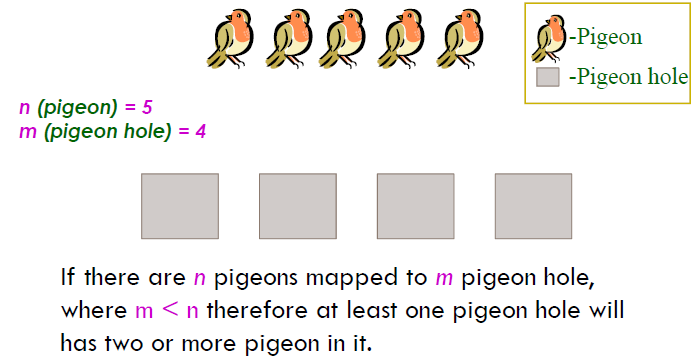

'''
=== GÜVERCİN YUVASI PRENSİBİ :

Bilgisayar bilimleri de dahil olmak üzere pek çok matematik temelli bilim ve mühendislik alanında kullanılan oldukça basit bir umdedir.
İsmini güvercin yuvalarından alan bu kaideye göre yuva sayısından fazla güvercin varsa ve bütün güvercinler bir yuvaya girecekse,en az
bir yuvaya birden fazla güvercin girmek zorundadır.

===== Matematiksel Gösterimi :
Bu durumu sembollerle göstermemiz gerekirse n tane yuva ve m tane güvercin için:
m > n durumunda en az bir yuvada birden fazla güvercin bulunmalıdır.

.Güvercin yuvası prensibi
[#img-pigeon]
[caption="Figure 1: "]

'''

ifdef::env-github[]
:tip-caption: :bulb:
:note-caption: :information_source:
:important-caption: :heavy_exclamation_mark:
:caution-caption: :fire:
:warning-caption: :warning:
endif::[]

[NOTE]
====
Örnek :

Bir Odada 8 kişi toplandığını düşünelim, en az kaç kişinin doğum günü
haftanın aynı güne denk gelecektir ? Cevap : 2 kişidir.
====

[TIP]
====
Çözüm :

8 kişi haftanın 7 gününe ayrılacaktır.
Güvercin Yuvası Prensibine uyarlandığında güvercin sayısı kişi sayısı ile; haftanın 7 günü ise yuva sayısı ile özdeleştirilmiştir.

Kişi sayısı, haftanın günlerin sayısına (yani burada 7'e) bölünür. Sonra bulunan değer yukarıya yuvarlanır.

====

'''

===== Yukarıdaki örneğin matematiksel çözümü :

.Ornek_cozumu.py
[source,python]
----
math.ceil(Güvercin sayısı / Yuva sayısı)= math.ceil(Kişi sayısı / Haftanın gün sayısı)
math.ceil(8/7)=2
----

====== [green]#Seçtiğim Senaryonun Python Kodları Aşağıdaki Gibidir:# 

.Odev1.py
[source,python]
----
# Kutuphaneler
import math;

#Fonksiyonlar

def InputKontrolu(GirilenKisiSayisi): # Bir harf girildiğinde veya bir negatif sayı girildiğinde matematik işlemleri yapılmaz hata verir
    deger = str(GirilenKisiSayisi)
    if not deger.isdigit(): # Girilen değer bir sayı olup olmadığını kontrol ediliyor
        return False
    elif (int(deger)<1 ) or (int(deger)>96): # Verilen aralık :1 ile 96 kişi arasında olması kontrolu
        return False
    else:
        return True

def Result(Kisi_Sayisi): #Güvercin Yuvası Prensibi Uygulanıyor ve odadaki toplanan kişi sayısı haftanın 7 gününe bölünür

    result=(math.ceil(int(Kisi_Sayisi)/7.0)) # 7.0 değer haftanın günlerine ait

    return result

while True:
    print("Lütfen 1 ile 76 aralığında bir sayı giriniz !!")
    Kisi_Sayisi=input("Odada toplamda kaç kişi bulunmakta ? ")

    if InputKontrolu(Kisi_Sayisi) == True:
        print("Bu grupta en az %d kişinin doğum günü haftanın aynı güne denk gelecektir !!" % Result(Kisi_Sayisi))
    else:
        print("İstenilen aralıkta bir sayı giriniz lütfen !!")
    print("\n")
----

